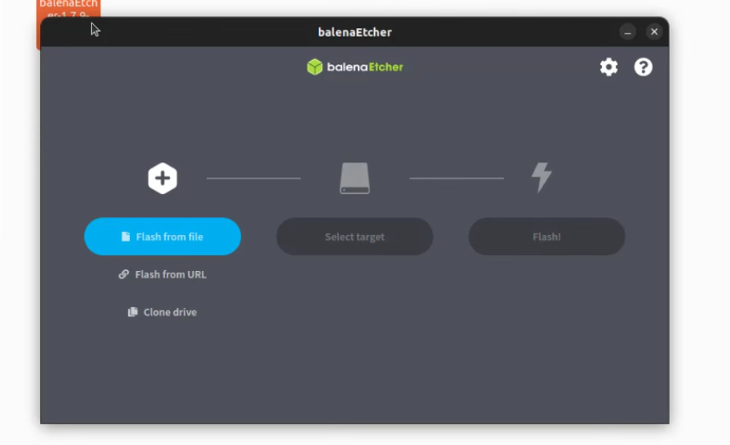
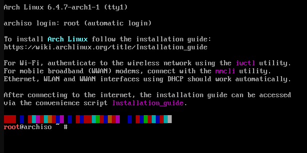

# Installation guide

This is a simple Arch installation guide for new users.
This guide will be divided into 1 part for making the bootable usb
and 5 parts for the actual installation.

## Usb preparation:

1. First you need to go to the Arch linux website and download the latest Arch iso file([Arch linux site](https://archlinux.org/))

2. Than you need a usb flash drive with a minimum size of 4Gb

3. After this you need a software to falsh the iso into the usb flash drive i reccomand Balena etcher([Balena etcher site](https://etcher.balena.io/))

4. After just select your usb and the arch iso and click flash
   
   

5. Wait till it finish falshing and than the usb is ready to be used

6. Now plug your usb flash drive in the pc and boot from it
   
   - to boot from in you can just reboot the pc with the usb in, and press the boot order key (usually is F11 or F12)

7. This is what you should see after booting in
   
   

## Step 1 |Pre-installation

1. Firstly, if you need to set the your keyboard layout (The default one is US) do this command´s to set it right: 
   
   ```bash
   localctl list-keymaps  #to list all the keyboard layout
   ```
   
   ```bash
   loadkeys <name of the layout> #to set the layout
   ```

2. Now you have to verify the boot mode(UEFI or BIOS/CMS), to do it use this command:
   
   ```bash
   cat /sys/firmware/efi/fw_platform_size #check the boot mood
   ```
- if it gives you **64** or **32** your are respectly on a 64 or 32 bit mashine with UEFI

- and if it gives you **`No such file or directory`** the system may be on BIOS or CMS
3. To install Arch you need to be connected to the internet.  
   
   - If you can, use an **ethernet cable**.  
   
   - If not, use the following commands for Wi-Fi:
     
     ```bash
     iwctl  # tool we are going to use
     ```
     
     ```bash
     [iwd] device list  # list all the devices
     ```
